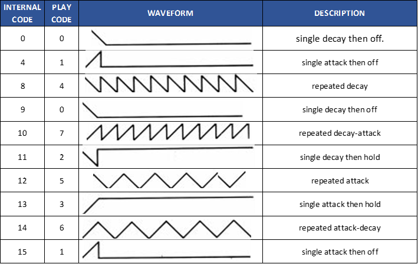
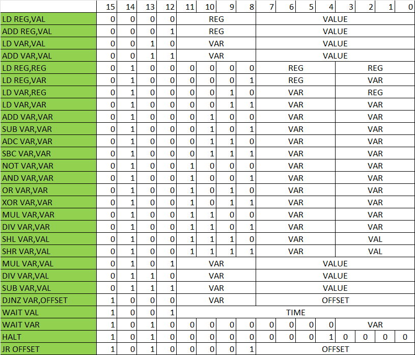

## AY SYNTHESIZER

The AY synthesizer included in the SD81 Booster is a software emulator of the AY-3-8910/12 chip.
It can play up to three voices plus envelopes and noise.
It is also compatible at register level.

### AY Registers supported

| REGISTER | DESCRIPTION | B7 | B6 | B5 | B4 | B3 | B2 | B1 | B0 |
| ------| ----| ----| ----| ----| ----| ----| ----| ----| ----|
| R0 | Channel A Tone Period Fine Tune | B7 | B6 | B5 | B4 | B3 | B2 | B1 | B0 |
| R1 | Channel A Tone Period Coarse Tune |    |    |    |    | B3 | B2 | B1 | B0 |
| R2 | Channel B Tone Period Fine Tune | B7 | B6 | B5 | B4 | B3 | B2 | B1 | B0 |
| R3 | Channel B Tone Period Coarse Tune |    |    |    |    | B3 | B2 | B1 | B0 |
| R4 | Channel C Tone Period Fine Tune | B7 | B6 | B5 | B4 | B3 | B2 | B1 | B0 |
| R5 | Channel C Tone Period Coarse Tune |    |    |    |    | B3 | B2 | B1 | B0 |
| R6 | Noise Period |    |    |    | B4 | B3 | B2 | B1 | B0 |
| R7 | Enable |    |    | Noise C | Noise B | Noise A | Tone C | Tone B | Tone A |
| R8 | Channel A Amplitude |    |    |    | Mode | L3 | L2 | L1 | L0 |
| R9 | Channel B Amplitude |    |    |    | Mode | L3 | L2 | L1 | L0 |
| R10 | Channel C Amplitude |    |    |    | Mode | L3 | L2 | L1 | L0 |
| R11 | Envelope Period Fine Tune | B7 | B6 | B5 | B4 | B3 | B2 | B1 | B0 |
| R12 | Envelope Period Coarse Tune | B7 | B6 | B5 | B4 | B3 | B2 | B1 | B0 |
| R13 | Envelope Shape/Cycle |    |    |    |    |    | B2 | B1 | B0 |

### Parameters used in a PLAY string command

| STRING | FUNCTION |
| ------| -----------|
| A..G | Specifies the pitch of the note within the current octave range. |
| **A**..**G** (inverted) | Specifies the pitch of the note within the current octave range + 1. |
| N, ' ' | Dummy note. |
| V | Specifies the volume to be used (followed by 0 to 15). |
| - | Specifies that a tied note is to be played. |
| £ | Specifies that the note which follows must be flattened. |
| = | Specifies that the note which follows must be sharpened. |
| O | Specifies the octave number to be used (followed by 0 to 8). |
| 1...12 | Specifies the length of notes to be used. |
| & | Specifies that a rest is to be played. |
| W | Specifies the volume effect to be used in a string (see envelope table). |
| U | Enables the volume effect. |
| X | Specifies duration of volume effect (followed by 0 to 65535). |
| T | Specifies tempo of music (followed by 60 to 240). |
| ( ) | Specifies that the enclosed phrase must be repeated. |
| \: \: | Specifies that the enclosed comment is to be skipped over. |
| H | Specifies that the PLAY command must stop. |

### Envelope table

---

## VGM PLAYER

The interface incorporates a [VGM file player](https://vgmrips.net/wiki/VGM_Specification), which plays these files in the background while the program runs on the ZX81. Only opcodes referring to the AY chip are supported:

| CODE | PARAMS | DESCRIPTION |
| ------| -----------| -----------|
| 0x61 | nn nn | Wait n samples, n can range from 0 to 65535 (approx 1.49 seconds). Longer pauses are represented by multiple wait commands. |
| 0x62 |   | Wait 735 samples (60th of a second) — shortcut for 0x61 0xDF 0x02. |
| 0x63 |   | Wait 882 samples (50th of a second) — shortcut for 0x61 0x72 0x03. |
| 0xA0 | aa dd | AY8910, write value dd to register aa. |

---

## PROGRAMMABLE EFFECT GENERATOR (PEG)

PEG is an assembly language specifically designed to generate sound effects on the interface. Like the VGM player, PEG runs in the background without using the ZX81's CPU. The PEG supports a maximum of three threads running in parallel.

Supported instructions:

---

## SPEECH SYNTHESIZER

The SD81 Booster includes a speech synthesizer based on the **SP0256** chip by General Instrument — the same synthesizer used by the **Currah MicroSpeech** (ZX Spectrum) and **The Voice** (Videopac G7000 / Odyssey 2). The allophone samples are stored in the internal memory of the MCU; no files on the SD card are required.

### Basic usage

    LOAD *SAY "text"

The synthesizer accepts English text directly and converts it to phonemes internally using a built-in dictionary. Numbers (0 to billions) are read aloud automatically in English.

**Background playback:** prefix the text with `*` to play in background (the ZX81 continues executing while the speech plays):

    LOAD *SAY "* text"

This behaviour is identical to the `LOAD *PLAY` command.

### Punctuation pauses

Punctuation characters embedded in the text string produce pauses of different durations:

| Character | Pause duration |
|-----------|---------------|
| Space | Short pause |
| Comma `,` | Medium pause |
| Semicolon `;` | Long pause |

### Direct allophone access (advanced)

For precise phonetic control, allophones can be sent directly using MCU command 22 (`LOAD *SAY` with a binary allophone array). The available allophones follow the SP0256-AL2 standard:

| Code | Sound | Example |
|------|-------|---------|
| $00 | PA1 | 10 ms pause |
| $01 | PA2 | 30 ms pause |
| $02 | PA3 | 50 ms pause |
| $03 | PA4 | 100 ms pause |
| $04 | PA5 | 200 ms pause |
| $05 | OY | b**oy** |
| $06 | AY | sk**y** |
| $07 | EH | **e**nd |
| $08 | KK3 | **c**omb |
| $09 | PP | **p**ow |
| $0A | JH | dod**ge** |
| $0B | NN1 | thi**n** |
| $0C | IH | s**i**t |
| $0D | TT2 | **t**o |
| $0E | RR1 | **r**ural |
| $0F | AX | s**u**cceed |
| $10 | MM | **m**ilk |
| $11 | TT1 | par**t** |
| $12 | DH1 | **th**ey |
| $13 | IY | s**ee** |
| $14 | EY | b**ei**ge |
| $15 | DD1 | coul**d** |
| $16 | UW1 | t**oo** |
| $17 | AO | **au**ght |
| $18 | AA | h**o**t |
| $19 | YY2 | **y**es (long) |
| $1A | AE | h**a**t |
| $1B | HH1 | **h**e |
| $1C | BB1 | **b**usiness (short) |
| $1D | TH | **th**in |
| $1E | UH | b**oo**k |
| $1F | UW2 | f**oo**d |
| $20 | AW | **ou**t |
| $21 | DD2 | **d**o |
| $22 | GG3 | wi**g** |
| $23 | VV | **v**est |
| $24 | GG1 | **g**ot |
| $25 | SH | **sh**ip |
| $26 | ZH | a**z**ure |
| $27 | RR2 | b**r**ain |
| $28 | FF | **f**ood |
| $29 | KK2 | **sk**y |
| $2A | KK1 | **c**an't |
| $2B | ZZ | **z**oo |
| $2C | NG | a**ng**chor |
| $2D | LL | **l**ake |
| $2E | WW | **w**ool |
| $2F | XR | r**epair** |
| $30 | WH | **wh**ig |
| $31 | YY1 | **y**es (short) |
| $32 | CH | **ch**urch |
| $33 | ER1 | f**ir** (short) |
| $34 | ER2 | f**ir** (long) |
| $35 | OW | b**eau** |
| $36 | DH2 | **th**ey |
| $37 | SS | ve**s**t |
| $38 | NN2 | **n**o |
| $39 | HH2 | **h**oe |
| $3A | OR | st**ore** |
| $3B | AR | al**ar**m |
| $3C | YR | cl**ear** |
| $3D | GG2 | **g**uest |
| $3E | EL | sadd**le** |
| $3F | BB2 | **b**usiness (long) |
