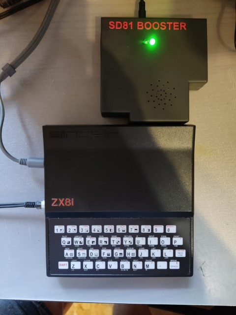

# SD81 Booster — SD, sound, voice and memory interface for ZX81

An open hardware, open source project packing many features in a single interface.



## Credits

```
Hardware design & MCU firmware:  Alejandro Valero (wilco2009)
Z80 code / Modified ROM:         Pedro Gimeno (pgimeno)

Based on ZX81 ROM disassembly by Geoff Wearmouth
Preserved by Tomaž Šolc (https://www.tablix.org/~avian/spectrum/rom/)
```

## Features

- Load and save programs from/to a FAT32 microSD card in `.P` format, supporting common file and directory operations: list directory, copy/move/rename/delete files, change/create/remove directories.
- Up to 512 KB RAM, using a memory mapper in 8 KB blocks. There's also a simplified mode that allows up to 256 KB RAM, needing very simple paging code.
- The selected mapper page for any given block can be read back.
- Up to 128 user-defined characters. Compatible with the QuickSilva character definition mode — no longer restricted to the ROM's 64 characters and their inverses.
- AY-3-8910/12 sound chip emulation with `PLAY` command.
- AY VGM player, plays in background (does not support VGMs containing other chips than the AY).
- AY sound effects in background, via a programmable virtual machine (PEG).
- Speech synthesis based on the SP0256 chip (General Instrument), the same synthesiser used by the Currah MicroSpeech (ZX Spectrum) and The Voice (Videopac G7000/Odyssey 2). The `LOAD *SAY` command accepts English text directly.
- WAV audio file playback (uncompressed PCM).
- RGB colour video output, compatible with the Chroma81 interface standard.
- Real-time clock (RTC) with CR2032 backup battery.
- Programmable DB9 joystick port.
- Possibility to run code in the region between 32K and 48K (MC45 mode — see below).
- Minimal changes to the standard ROM. In particular, the ZX Printer and tape routines are preserved intact.

### What it doesn't do

- File names are restricted to characters supported by the ZX81 keyboard. The permitted characters for filenames are `A`–`Z`, `0`–`9`, `.`, `,`, `;`, `$`, `(`, `)`, `=`, `+`, `-`. The `/` character is the directory separator. Letters are treated as upper case when saving.
- AY sound chip emulation is not cycle-accurate.
- AY sound chip register access is not compatible with other interfaces.
- The memory mapping I/O port and layout are not compatible with other interfaces.
- There are no new BASIC keywords; most new functions are implemented through extensions to the `LOAD` and `SAVE` commands.

### Possible compatibility issues

- The SD81 Booster incorporates the functionality of the Chroma81 (RGB colour video) and QuickSilva (128 user-defined characters) interfaces. It is not designed to be used simultaneously with those physical interfaces connected at the same time.
- The memory area between 8 KB and 16 KB is no longer a mirror of the area between 0 and 8 KB.
- The same area is now read/write rather than read-only. If a program writes to used areas within that space, the expanded commands may crash and a hardware reset will be necessary.
- The ROM changes 8 bytes with respect to the original. Programs that depend on those specific bytes may fail (considered highly unlikely in practice).
- The memory mapper I/O port may clash with that of other interfaces.
- The general command interface I/O ports might clash with those of other interfaces.
- The USB-C port uses a CH340G chip for serial console output (115200-8N1). In Spectrum mode, port FBh is used, which is incompatible with the ZX Printer.

## MC45

MC45 (Machine Code in blocks 4 and 5) is a mode that allows any Z80 instruction — not just those with opcodes in the ranges 40h–7Fh and C0h–FFh — to run in the address range 8000h–BFFFh. The drawback is that the display file can no longer be in that area, so BASIC programs larger than 16 KB cannot be loaded or written while this mode is active.

The interface already includes the protective resistor internally. No modification to the ZX81 is required. There is no jumper to disable this feature on the current hardware version.

## Getting started

The **SYS** folder must be present in the root of the microSD card — without it the interface will not start. It contains the ROM files required for operation.

See [MANUAL/ES/SD81_Manual_ES.md](MANUAL/ES/SD81_Manual_ES.md) for the full user manual in Spanish.

For the technical reference and MCU command descriptions, see the [DOC folder](DOC/).

## Firmware update

**Normal update (via SD bootloader):**
1. Copy the firmware `.bin` file (renamed as `firmware.bin`) to the root of the SD card.
2. Power on the ZX81. The bootloader detects the file, flashes it at `0x0800C000`, deletes it, and boots the application.

**Emergency recovery (via USB, for advanced users):**
1. Open the interface case and bridge the two upper pins of jumper **JP7** (on the component side, next to the USB-C port).
2. Connect the USB-C cable to a PC.
3. Use **STM32CubeProgrammer** to flash:
   - Bootloader at `0x08000000`
   - Application at `0x0800C000`

See [FIRMWARE/README_update.md](FIRMWARE/README_update.md) for detailed instructions.

## Building the ZX81 ROM

The ROM listing used here is the disassembly work of [Geoff Wearmouth](http://web.archive.org/web/20150815035607/http://www.wearmouth.demon.co.uk/zx81.htm), preserved by [Tomaž Šolc](https://www.tablix.org/~avian/spectrum/rom/).

The ROM can be built using [GNU binutils for Z80](https://github.com/atsidaev/binutils-z80), [Pasmo](https://pasmo.speccy.org/) or [MDL](https://github.com/santiontanon/mdlz80optimizer).

To build with GNU binutils:

    z80-unknown-coff-as sdmodrom.asm -o sdmodrom.o
    z80-unknown-coff-ld -Ttext 0 sdmodrom.o -o sdmodrom.bin

To build with Pasmo:

    pasmo sdmodrom.asm sdmodrom.bin

To build with MDL (dialects `pasmo` or `macro80`):

    java -jar mdl.jar -dialect macro80 -bin sdmodrom.bin sdmodrom.asm

## Related projects

- [Mazogs with Chroma81 colour](https://codeberg.org/pgimeno/Mazogs) by Pedro Gimeno
